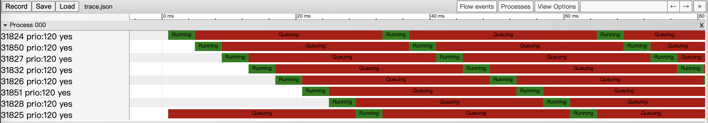

## perf scheduler event to chrome tracing

### It can help you analysis:  
	which thread is running
	which thread is queuing in run queue
	which cpu is busy - nr_running > 1
	the origin and destination cpu when migrate a thread.
	when to wakeup a thread

	Convert "perf sched script" to "chrome tracing" that you can zoom in/out
	event: sched_wakeup,sched_wakeup_new,sched_switch,sched_migrate_task

#### legend
Now the color bars:

	red:    thread is queuing on cpu, runnable
	green:  thread is running  
	olive:  cpu is idle
	yellow: migrate
	blue:   wakeup

#### demo of run 8 yes on CPU0

### Usage
	two ways to analysis cpu schedule event

#### if perf complied with python support
	1. sudo perf sched record -- sleep 1
	2. perf sched -s perf_sched_to_chrome_tracing.py
	3. open Google Chrome web browser and goto chrome://tracing
	4. click the load button to load trace.json

#### if perf complied without python support
	1. sudo perf sched record -- sleep 1
	2. sudo perf sched script > s.log
	  2.1. if your kernel not patched with commit 3054426dc68, sh sched_switch_prev_state_fixup.sh s.log  
			the use fixed.s.log as the input of text_perf_sched_to_chrome_tracing.py
	3. sudo ./text_perf_sched_to_chrome_tracing.py -i s.log -o trace.json
	4. open Google Chrome web browser and goto chrome://tracing
	5. click the load button to load trace.json

### notes
	please make sure your kernel patched with the following commit, otherwise you should:

	if perf complied without python support
	use this wrokaround script "sched_switch_prev_state_fixup.sh" to correct to the right prev_state.

	if perf complied with python support
	set g_need_sched_state_fixup=1

https://git.kernel.org/pub/scm/linux/kernel/git/torvalds/linux.git/commit/?id=3054426dc68e5d63aa6a6e9b91ac4ec78e3f3805
